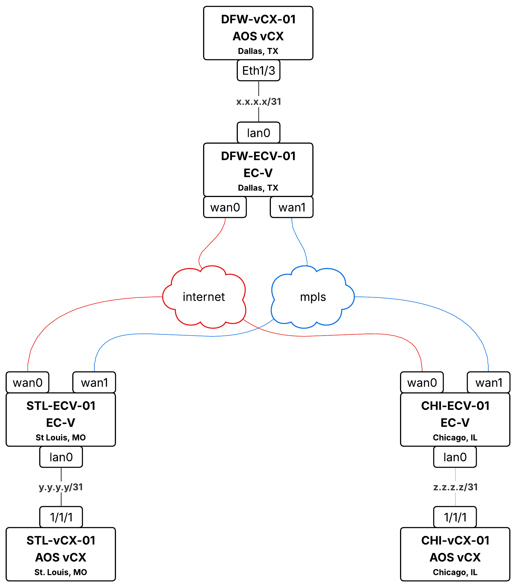

# ECOS + AOS-CX ContainerLab

Run HPE Aruba EdgeConnect SD-WAN and AOS-CX switches together in ContainerLab.

## What's This?

This repo provides everything needed to run a complete EdgeConnect SD-WAN lab with:
- **EdgeConnect Virtual (EC-V)** - SD-WAN appliances
- **AOS-CX Virtual (vCX)** - Data center switches
- **Linux transport nodes** - Simulating internet and MPLS networks

Built on [vrnetlab](https://github.com/srl-labs/vrnetlab) for packaging VMs in containers and [ContainerLab](https://containerlab.dev/) for topology orchestration.

### Lab Topology



**Connections:**
- All EC-V `wan0` interfaces connect to **internet** (Linux node)
- All EC-V `wan1` interfaces connect to **mpls** (Linux node)
- DFW-ECV-01 `lan0` ↔ DFW-vCX-01 `1/1/1`
- STL-ECV-01 `lan0` ↔ STL-vCX-01 `1/1/1`
- CHI-ECV-01 `lan0` ↔ CHI-vCX-01 `1/1/1`

### Current State

> **Note:** This project deploys the containers and performs basic bootstrapping (hostname, admin credentials, SSH/HTTPS enablement). All EdgeConnect and AOS-CX configuration beyond bootstrapping must be done manually:
> - **EdgeConnect**: Configure via Orchestrator or local Web UI
> - **AOS-CX**: Configure via SSH or REST-API
>
> Future iterations will include cloud-init support for EC-V and built-in AOS-CX startup configurations to have the lab fully operational out of the box. I may also provide a YAML preconfiguration for one of the EC-Vs to support automated provisioning via Orchestrator. 

## Prerequisites

### System Requirements

| Requirement | Minimum | Notes |
|-------------|---------|-------|
| **OS** | Linux (Ubuntu 20.04+, Debian 11+, RHEL 8+) | Native Linux required |
| **CPU** | 8+ cores with virtualization extensions | Intel VT-x or AMD-V required |
| **RAM** | 40GB+ | EC-V: 4GB x 3 = 12GB, AOS-CX: 8GB x 3 = 24GB, Linux: minimal |
| **Disk** | 50GB free | For Docker images and VM disks |
| **KVM** | Enabled and accessible | Required for running VMs in containers |

### Required Software

1. **KVM/Virtualization Support** - VMs run inside QEMU/KVM
2. **Docker** - Container runtime
3. **ContainerLab** - Network topology orchestration
4. **vrnetlab** - Framework for packaging VMs into container images

### Required Images (Note: Obtain these from HPE/Aruba)

1. **EdgeConnect EC-V qcow2** - e.g., `ECV-9.6.1.0_106887.qcow2`
2. **AOS-CX vmdk** - e.g., `arubaoscx-disk-image-genericx86-p4-20250822141147.vmdk`

## Installation Guide

### Step 1: Verify KVM Support

```bash
# Check for virtualization extensions
grep -E '(vmx|svm)' /proc/cpuinfo

# Verify /dev/kvm exists
ls -la /dev/kvm

# If missing, load KVM modules
sudo modprobe kvm
sudo modprobe kvm_intel  # or kvm_amd
```

### Step 2: Install Docker

```bash
curl -fsSL https://get.docker.com | sudo sh
sudo usermod -aG docker $USER
# Note: Log out and back in
```

### Step 3: Install ContainerLab

```bash
# Quick install script
bash -c "$(curl -sL https://get.containerlab.dev)"
clab version
```

### Step 4: Clone and Set Up vrnetlab

vrnetlab is the framework that packages VMs into container images. You need to clone it and add our custom node types.

```bash
git clone https://github.com/srl-labs/vrnetlab.git
cd vrnetlab
```

### Step 5: Add EdgeConnect (ECOS) Node Type to vrnetlab

The AOS-CX node type already exists in vrnetlab. However, EdgeConnect (ECOS) is a custom node type that must be added manually.

Copy the ECOS docker components from this repository into vrnetlab:

```bash
# From the vrnetlab directory, create the aruba/ecos folder and copy files
# Adjust the path to where you cloned this repo
mkdir -p aruba/ecos/docker
cp /path/to/clab-ecos-aoscx/ecos/Makefile ./aruba/ecos/
cp /path/to/clab-ecos-aoscx/ecos/docker/* ./aruba/ecos/docker/
```

After copying, your vrnetlab directory should contain:
```
vrnetlab/
├── aruba/
│   ├── aoscx/             # Already exists in vrnetlab
│   │   ├── Makefile
│   │   ├── README.md
│   │   └── docker/
│   │       ├── Dockerfile
│   │       └── launch.py
│   └── ecos/              # Added from this repo
│       ├── Makefile
│       └── docker/
│           ├── Dockerfile
│           └── launch.py
├── ... (other vrnetlab node types)
```

### Step 6: Copy Vendor Images into vrnetlab Folders

Place your vendor images (obtained from HPE) into the respective vrnetlab folders:

```bash
# Copy EdgeConnect qcow2 image to the aruba/ecos folder
cp /path/to/ECV-9.6.1.0_106887.qcow2 ./aruba/ecos/

# Copy AOS-CX image to the existing aoscx folder
cp /path/to/arubaoscx-disk-image-genericx86-p4-20250822141147.vmdk ./aruba/aoscx/
```

### Step 7: Build Docker Images

Build from each directory:

**Build EdgeConnect (ECOS):**

```bash
cd aruba/ecos
make docker-image
cd ..
```

**Build AOS-CX:**

```bash
cd aruba/aoscx
make docker-image
cd ..
```

Verify images were created:
```bash
docker images | grep aruba
```

## Quick Start

Once you've built the Docker images (Steps 4-7), return to this repository directory to deploy the lab.

```bash
cd /path/to/clab-ecos-aoscx
```

### 1. Configure Credentials

```bash
cp env.example .env
# Edit with your credentials
vi .env
```

### 2. Update Topology Image Tags

Edit `examples/topology.clab.yml` to match your image versions:

```yaml
# Update these to match your built images
image: vrnetlab/aruba_ecos:9.6.1.0_106887
image: vrnetlab/aruba_arubaos-cx:20250822141147
```

### 3. Deploy the Lab

```bash
# Source environment variables first
source .env

# Deploy with sudo -E to preserve environment variables
sudo -E clab deploy -t examples/topology.clab.yml
```

> **Important:** The `-E` flag is required to pass environment variables (like `ECOS_REGISTRATION_KEY` and `ECOS_ACCOUNT_NAME`) to the containers. Without it, the literal variable names (e.g., `$ECOS_REGISTRATION_KEY`) will appear in your device configuration instead of the actual values.

### 4. Monitor Boot Progress

EC-V boots in ~60-90 seconds, AOS-CX takes ~2-3 minutes:

```bash
# Watch all containers
watch docker ps

# Check specific node logs
docker logs -f clab-ecos-aoscx-DFW-ECV-01
docker logs -f clab-ecos-aoscx-DFW-vCX-01
```

### 5. Access Your Devices

| Node | Type | Web UI | SSH |
|------|------|--------|-----|
| DFW-ECV-01 | EC-V | https://172.30.30.21 | ssh admin@172.30.30.21 |
| STL-ECV-01 | EC-V | https://172.30.30.22 | ssh admin@172.30.30.22 |
| CHI-ECV-01 | EC-V | https://172.30.30.23 | ssh admin@172.30.30.23 |
| DFW-vCX-01 | AOS-CX | https://172.30.30.31 | ssh admin@172.30.30.31 |
| STL-vCX-01 | AOS-CX | https://172.30.30.32 | ssh admin@172.30.30.32 |
| CHI-vCX-01 | AOS-CX | https://172.30.30.33 | ssh admin@172.30.30.33 |
| INTERNET | Linux | N/A | docker exec -it clab-ecos-aoscx-internet bash |
| MPLS | Linux | N/A | docker exec -it clab-ecos-aoscx-mpls bash |

Default credentials: `admin` / `admin`

### 6. Tear Down

```bash
sudo clab destroy -t examples/topology.clab.yml --cleanup
```

## Configuration

### Environment Variables

| Variable | Description | Applies To |
|----------|-------------|------------|
| `ECOS_ADMIN_PASSWORD` | Admin password | EC-V |
| `ECOS_REGISTRATION_KEY` | Portal registration key | EC-V |
| `ECOS_ACCOUNT_NAME` | Portal account name | EC-V |
| `AOSCX_ADMIN_PASSWORD` | Admin password | AOS-CX |

### Interface Mapping

**EdgeConnect EC-V:**

| Container Interface | VM Interface | Purpose |
|---------------------|--------------|---------|
| eth0 | mgmt0 | Management (DHCP) |
| eth1 | wan0 | Primary WAN |
| eth2 | lan0 | Primary LAN |
| eth3 | wan1 | Secondary WAN |
| eth4 | lan1 | Secondary LAN |

**AOS-CX:**

| Container Interface | VM Interface | Purpose |
|---------------------|--------------|---------|
| eth0 | OOBM | Management |
| eth1 | 1/1/1 | Data port |
| eth2 | 1/1/2 | Data port |
| eth3+ | 1/1/3+ | Data ports |

## Troubleshooting

### Build Issues

```bash
# From the vrnetlab directory, verify vendor images are in the correct folders
ls aruba/ecos/*.qcow2
ls aruba/aoscx/*.vmdk

# Check existing docker images
docker images | grep -E "(aruba_ecos|aruba_arubaos-cx)"

# Rebuild an image (remove old first if needed)
docker rmi vrnetlab/aruba_ecos:<version>
cd aruba/ecos && docker build --build-arg IMAGE=<your-image>.qcow2 -t vrnetlab/aruba_ecos:<version> .
```

### Environment Variables Not Applied

If your EdgeConnect devices show literal variable names (e.g., `$ECOS_ACCOUNT_NAME`) instead of actual values:

```bash
# Destroy the lab
sudo clab destroy -t examples/topology.clab.yml

# Source environment variables
source .env

# Verify variables are set
echo $ECOS_ACCOUNT_NAME

# Redeploy with -E flag to preserve environment
sudo -E clab deploy -t examples/topology.clab.yml
```

### AOS-CX Not Booting

AOS-CX requires 8GB RAM per instance. Check available memory and container resource usage:
```bash
free -h
docker stats --no-stream
docker logs clab-ecos-aoscx-DFW-vCX-01
```

If running on a VM, ensure you have at least 40GB RAM for the full topology.

### KVM Permission Denied

```bash
sudo usermod -aG kvm $USER
# Log out and back in
```

### Container Health

```bash
# Check health status
docker ps --format "table {{.Names}}\t{{.Status}}"

# Detailed health check
docker inspect --format='{{.State.Health.Status}}' clab-ecos-aoscx-DFW-ECV-01
```

### EC-Vs Not Showing Up in Orchestrator

If your EdgeConnect appliances are deployed but not appearing in Orchestrator, the environment variables (`ECOS_ACCOUNT_NAME`, `ECOS_REGISTRATION_KEY`) may not have been passed into the containers correctly.

**Verify the environment variables inside a container:**

```bash
# Check a single EC-V container
docker exec clab-chi-stl-dfw_ec-cx-DFW-ECV-01 printenv | grep ECOS

# Check all EC-V containers at once
for ecv in DFW-ECV-01 STL-ECV-01 CHI-ECV-01; do
  echo "=== $ecv ==="
  docker exec clab-chi-stl-dfw_ec-cx-$ecv printenv | grep ECOS
done
```

If the variables are missing or contain literal `$` references, destroy and redeploy with the correct environment:

```bash
sudo clab destroy -t examples/topology.clab.yml --cleanup
source .env
echo $ECOS_ACCOUNT_NAME   # verify it's set
sudo -E clab deploy -t examples/topology.clab.yml
```

### Performance Problems / Tunnels Not Coming Up or Unstable

If tunnels are failing to establish or are flapping, the host may be under resource pressure. Check host resources and container utilization:

```bash
# Check host CPU and memory
free -h
nproc
uptime

# Check resource usage across all lab containers
docker stats --no-stream --format "table {{.Name}}\t{{.CPUPerc}}\t{{.MemUsage}}\t{{.MemPerc}}" | grep clab

# Check for CPU steal or overcommit (high steal% means the host itself is a VM that is overprovisioned)
top -bn1 | head -5

# Check disk I/O which can impact QEMU performance
iostat -x 1 3

# Check for out-of-memory kills
dmesg | grep -i "oom\|killed process" | tail -10
```

Each EC-V requires ~4GB RAM and each AOS-CX requires ~8GB RAM. The full 3-site topology needs approximately 40GB+ total. If the host is under pressure, consider deploying fewer nodes.

### Not Sure if EC-Vs Have Actually Booted

The vrnetlab launch script runs QEMU inside each container. You can verify that the VM is running and has completed booting by checking for the QEMU process and looking for the "login prompt detected" message in the container logs:

```bash
# Check if QEMU is running inside each EC-V container
for ecv in DFW-ECV-01 STL-ECV-01 CHI-ECV-01; do
  echo "=== $ecv ==="
  docker exec clab-chi-stl-dfw_ec-cx-$ecv ps aux | grep qemu
done

# Check container logs for the login prompt detection (indicates boot completed)
for ecv in DFW-ECV-01 STL-ECV-01 CHI-ECV-01; do
  echo "=== $ecv ==="
  docker logs clab-chi-stl-dfw_ec-cx-$ecv 2>&1 | grep -i "login prompt"
done

# Follow logs in real time for a specific node to watch boot progress
docker logs -f clab-chi-stl-dfw_ec-cx-DFW-ECV-01
```

If QEMU is not running, check for KVM/permission issues. If QEMU is running but no login prompt is detected, the VM may still be booting or may have failed during startup — check the full logs for errors.

### Clean Restart

```bash
sudo clab destroy -t examples/topology.clab.yml --cleanup
docker rm -f $(docker ps -aq --filter name=clab)
source .env
sudo -E clab deploy -t examples/topology.clab.yml
```

## Directory Structure

```
clab-ecos-aoscx/
├── README.md
├── env.example
├── .gitignore
├── topology.png
├── configs/              # Device startup configurations
│   ├── CHI-vCX-01.cfg
│   ├── DFW-vCX-01.cfg
│   ├── STL-vCX-01.cfg
│   ├── internet-dnsmasq.conf
│   └── mpls-dnsmasq.conf
├── ecos/                 # Copy to vrnetlab/aruba/ecos/
│   ├── Makefile
│   ├── README.md
│   └── docker/
│       ├── Dockerfile
│       └── launch.py
└── examples/
    └── topology.clab.yml
```

After setup, your vrnetlab directory should look like:
```
vrnetlab/
├── aruba/
│   ├── aoscx/            # Already exists in vrnetlab
│   │   ├── Makefile
│   │   ├── README.md
│   │   ├── docker/
│   │   │   ├── Dockerfile
│   │   │   └── launch.py
│   │   └── arubaoscx-*.vmdk  # Your vendor image (from HPE)
│   └── ecos/             # From ecos/ (custom node type)
│       ├── Makefile
│       ├── docker/
│       │   ├── Dockerfile
│       │   └── launch.py
│       └── ECV-*.qcow2   # Your vendor image (from HPE)
└── ... (other vrnetlab node types)
```

## Security Considerations

This lab is designed for **isolated testing and development environments only**. Review these considerations before deployment:

- **Default Credentials**: Devices use `admin`/`admin` by default. Change passwords via environment variables (`ECOS_ADMIN_PASSWORD`, `AOSCX_ADMIN_PASSWORD`) before deployment
- **Credential Storage**: The `.env` file contains sensitive credentials. Ensure it is never committed to version control (included in `.gitignore`)
- **Environment Variables**: Credentials passed via environment variables may be visible in process listings. Use appropriate access controls on the host system
- **Network Isolation**: The management network (172.30.30.0/24) should not be exposed to untrusted networks
- **Console Access**: Initial device configuration is applied via console (telnet to QEMU). This occurs within the container and is not exposed externally
- **Lab Environment Only**: This topology is intended for lab, testing, and educational purposes. Do not use default configurations in production environments

## Useful Resources

- **[ContainerLab Documentation](https://containerlab.dev/)** - Full ContainerLab docs
- **[vrnetlab (srl-labs fork)](https://github.com/srl-labs/vrnetlab)** - VM containerization framework
- **[ContainerLab AOS-CX Guide](https://containerlab.dev/manual/kinds/vr-aoscx/)** - AOS-CX specific docs
- **[HPE Aruba EdgeConnect](https://www.arubanetworks.com/products/sd-wan/)** - EdgeConnect product info
- **[HPE Aruba AOS-CX](https://www.arubanetworks.com/products/switches/)** - AOS-CX product info

## License

This project adapts vrnetlab patterns for HPE Aruba network appliances.
EdgeConnect and AOS-CX are products of HPE Aruba Networks.

This software is provided "as-is" without any express or implied warranties. Use at your own risk.
