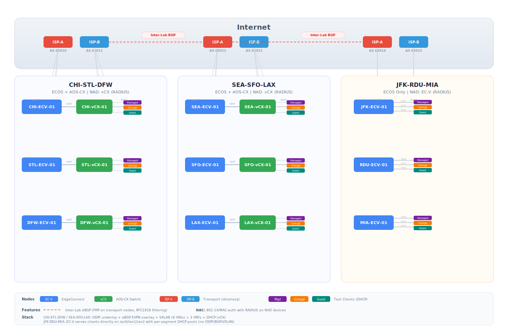

# ECOS + AOS-CX ContainerLab

Run HPE Aruba EdgeConnect SD-WAN and AOS-CX switches together in ContainerLab.

## What's This?

This repo provides everything needed to run a complete EdgeConnect SD-WAN lab with:
- **EdgeConnect Virtual (EC-V)** - SD-WAN appliances with Orchestrator preconfigurations
- **AOS-CX Virtual (vCX)** - Data center switches with full VXLAN/EVPN, BGP, OSPF, VRF, and NAC configurations
- **Linux transport nodes** - Simulating dual-ISP WAN networks with DHCP (dnsmasq)
- **Inter-lab BGP** - FRR-based eBGP mesh between transport nodes for cross-topology routing
- **NAC integration** - 802.1X/MAC-auth with RADIUS on NAD devices (vCX or EC-V depending on topology)
- **Test clients** - Per-segment Linux containers for validating end-to-end connectivity
- **Deploy/destroy scripts** - Automated topology deployment with config push, DHCP renewal, and teardown

Built on [vrnetlab](https://github.com/srl-labs/vrnetlab) for packaging VMs in containers and [ContainerLab](https://containerlab.dev/) for topology orchestration.

### Lab Topology



The lab consists of three independent 3-site topologies that can be deployed individually or together:

**Topology 1: CHI-STL-DFW** (Chicago, St. Louis, Dallas) - ECOS + AOS-CX
- Each site pairs an EC-V with a vCX switch connected via `lan0`
- vCX acts as the **NAD device** for NAC, communicating with RADIUS
- EC-V `wan0` → ISP-A, EC-V `wan1` → ISP-B
- Full OSPF/BGP/VXLAN/EVPN stack between EC-V and vCX
- 9 test clients (3 per site: managed, unmanaged, guest) connected to vCX access ports

**Topology 2: SEA-SFO-LAX** (Seattle, San Francisco, Los Angeles) - ECOS + AOS-CX
- Same architecture as CHI-STL-DFW
- vCX acts as the **NAD device** for NAC
- 9 test clients connected to vCX access ports

**Topology 3: JFK-RDU-MIA** (New York, Raleigh, Miami) - ECOS Only
- **No AOS-CX switches** - EC-V appliances serve clients directly
- EC-V uses 7 NICs with 3 LAN interfaces (`lan0`, `lan1`, `lan2`) for direct client attachment
- EC-V acts as the **NAD device** for NAC, communicating with RADIUS directly
- EC-V provides DHCP to clients on each LAN segment
- No OSPF, BGP, or VXLAN - simplified architecture for standalone SD-WAN testing

Each topology uses its own transport nodes (ISP-A, ISP-B) with unique management IPs to allow all three to run simultaneously on a shared 172.30.30.0/24 management network.

### Inter-Lab BGP

When multiple topologies are deployed, FRR (Free Range Routing) can be installed on the transport nodes to establish eBGP peering across labs. This enables:
- Cross-topology RFC1918 route exchange
- SD-WAN tunnel formation between appliances in different topologies
- End-to-end client connectivity across all 9 sites

Each ISP node has a unique ASN. ISP-A nodes peer with each other (AS 65010, 65012, 65014) and ISP-B nodes peer with each other (AS 65011, 65013, 65015). Prefix filtering ensures only RFC1918 routes are advertised.

Deploy inter-lab BGP with:
```bash
./bgp-interlab/deploy-all.sh
```

### Network Design

**Sites with AOS-CX (CHI-STL-DFW, SEA-SFO-LAX):**

Each site follows the same architecture:
- **EdgeConnect EC-V** handles SD-WAN overlay, connecting to two WAN transports (ISP-A + ISP-B) and one LAN interface to the local vCX switch
- **AOS-CX vCX** provides LAN switching with three customer segments (VRFs), VXLAN/EVPN for cross-site L2/L3 connectivity, and NAC (802.1X/MAC-auth)
- **Test clients** attach to access ports on the vCX, one per customer segment

| Layer | Technology | Details |
|-------|-----------|---------|
| Underlay | OSPF (area 0) | EC-V ↔ vCX LAN adjacency, loopback reachability |
| Overlay control | BGP (eBGP multihop) | EC-V ↔ vCX with L2VPN EVPN address-family |
| Overlay data | VXLAN | 6 VNIs per site (3 L2 bridge + 3 L3 routing per VRF) |
| Segmentation | VRFs | CSN_Managed, CSN_Unmanaged, CSN_Guest |
| VLANs | 1010, 1011, 1012 | Mapped to Managed, Unmanaged, Guest segments |
| NAC | 802.1X/MAC-auth | RADIUS on vCX with QUARANTINE (VLAN 999) pre-auth role |
| Client services | DHCP | Per-VRF DHCP servers on each vCX |

**Sites without AOS-CX (JFK-RDU-MIA):**

- **EdgeConnect EC-V** handles SD-WAN overlay and serves clients directly on `lan0`, `lan1`, `lan2`
- EC-V provides per-segment DHCP pools
- EC-V acts as the NAD device for NAC, communicating with the RADIUS server directly
- No OSPF, BGP, VXLAN, or VRF configuration needed

### What Gets Configured Automatically

**AOS-CX switches** receive full startup configurations via the deploy script:
- VRFs (CSN_Managed, CSN_Unmanaged, CSN_Guest) with EVPN route-targets
- OSPF and BGP (with EVPN address-family)
- VXLAN tunnel with L2 and L3 VNIs
- VLANs, SVI interfaces, and access ports
- DHCP servers per VRF
- NAC: RADIUS server, port-access roles (MANAGED, UNMANAGED, GUEST, QUARANTINE), MAC-auth on all client-facing ports

**EdgeConnect EC-V** appliances boot with basic credentials and Orchestrator registration info. Orchestrator preconfigurations are provided in `preconfig/` for import into Orchestrator to complete provisioning (deployment mode, interfaces, OSPF, BGP, VXLAN, overlays, segments, and DHCP for ECOS-only sites).

**Transport nodes** (ISP-A and ISP-B) configure themselves with IP addressing, DHCP (dnsmasq), IP forwarding, and NAT rules.

**Test clients** obtain DHCP addresses from their respective vCX VRF (CHI-STL-DFW, SEA-SFO-LAX) or EC-V DHCP pools (JFK-RDU-MIA) and set a default route via the LAN.

## Prerequisites

### System Requirements

| Requirement | Single Topology | Two Topologies | All Three | Notes |
|-------------|-----------------|----------------|-----------|-------|
| **OS** | Linux (Ubuntu 20.04+, Debian 11+, RHEL 8+) | Same | Same | Native Linux required |
| **CPU** | 8+ cores | 16+ cores | 24+ cores | Intel VT-x or AMD-V required |
| **RAM** | 40GB+ | 80GB+ | 100GB+ | EC-V: 4GB, AOS-CX: 8GB each |
| **Disk** | 50GB free | 100GB free | 150GB free | For Docker images and VM disks |
| **KVM** | Enabled and accessible | Same | Same | Required for running VMs in containers |

Note: JFK-RDU-MIA requires less RAM (~12GB for 3 EC-Vs) since it has no AOS-CX switches.

### Required Software

1. **KVM/Virtualization Support** - VMs run inside QEMU/KVM
2. **Docker** - Container runtime
3. **ContainerLab** - Network topology orchestration
4. **vrnetlab** - Framework for packaging VMs into container images
5. **sshpass** - Used by the deploy script for SSH config push to AOS-CX

### Required Images (Note: Obtain these from HPE/Aruba)

1. **EdgeConnect EC-V qcow2** - e.g., `ECV-9.6.1.0_106887.qcow2`
2. **AOS-CX vmdk** - e.g., `arubaoscx-disk-image-genericx86-p4-20250822141147.vmdk` (not needed for JFK-RDU-MIA only)

## Installation Guide

### Step 1: Verify KVM Support

```bash
# Check for virtualization extensions
grep -E '(vmx|svm)' /proc/cpuinfo

# Verify /dev/kvm exists
ls -la /dev/kvm

# If missing, load KVM modules
sudo modprobe kvm
sudo modprobe kvm_intel  # or kvm_amd
```

### Step 2: Install Docker

```bash
curl -fsSL https://get.docker.com | sudo sh
sudo usermod -aG docker $USER
# Note: Log out and back in
```

### Step 3: Install ContainerLab

```bash
# Quick install script
bash -c "$(curl -sL https://get.containerlab.dev)"
clab version
```

### Step 4: Clone and Set Up vrnetlab

vrnetlab is the framework that packages VMs into container images. You need to clone it and add our custom node types.

```bash
git clone https://github.com/srl-labs/vrnetlab.git
cd vrnetlab
```

### Step 5: Add EdgeConnect (ECOS) Node Type to vrnetlab

The AOS-CX node type already exists in vrnetlab. However, EdgeConnect (ECOS) is a custom node type that must be added manually.

Copy the ECOS docker components from this repository into vrnetlab:

```bash
# From the vrnetlab directory, create the aruba/ecos folder and copy files
# Adjust the path to where you cloned this repo
mkdir -p aruba/ecos/docker
cp /path/to/clab-ecos-aoscx/ecos/Makefile ./aruba/ecos/
cp /path/to/clab-ecos-aoscx/ecos/docker/* ./aruba/ecos/docker/
```

After copying, your vrnetlab directory should contain:
```
vrnetlab/
├── aruba/
│   ├── aoscx/             # Already exists in vrnetlab
│   │   ├── Makefile
│   │   ├── README.md
│   │   └── docker/
│   │       ├── Dockerfile
│   │       └── launch.py
│   └── ecos/              # Added from this repo
│       ├── Makefile
│       └── docker/
│           ├── Dockerfile
│           └── launch.py
├── ... (other vrnetlab node types)
```

### Step 6: Copy Vendor Images into vrnetlab Folders

Place your vendor images (obtained from HPE) into the respective vrnetlab folders:

```bash
# Copy EdgeConnect qcow2 image to the aruba/ecos folder
cp /path/to/ECV-9.6.1.0_106887.qcow2 ./aruba/ecos/

# Copy AOS-CX image to the existing aoscx folder
cp /path/to/arubaoscx-disk-image-genericx86-p4-20250822141147.vmdk ./aruba/aoscx/
```

### Step 7: Build Docker Images

Build from each directory:

**Build EdgeConnect (ECOS):**

```bash
cd aruba/ecos
make docker-image
cd ..
```

**Build AOS-CX:**

```bash
cd aruba/aoscx
make docker-image
cd ..
```

Verify images were created:
```bash
docker images | grep aruba
```

## Quick Start

Once you've built the Docker images (Steps 4-7), return to this repository directory to deploy the lab.

```bash
cd /path/to/clab-ecos-aoscx
```

### 1. Configure Credentials

```bash
cp env.example .env
# Edit with your credentials
vi .env
```

### 2. Update Topology Image Tags

Edit the topology files in `examples/` to match your image versions:

```yaml
# Update these to match your built images
image: vrnetlab/aruba_ecos:9.6.1.0_106887
image: vrnetlab/aruba_arubaos-cx:20250822141147
```

### 3. Install sshpass

The deploy script uses sshpass to push configurations to AOS-CX switches via SSH:

```bash
sudo apt install sshpass
```

### 4. Deploy the Lab

The deploy script handles topology deployment, waits for AOS-CX switches to boot, pushes startup configurations via SSH, and renews DHCP leases on test clients.

```bash
# Deploy a single topology
./scripts/deploy.sh chi-stl-dfw
./scripts/deploy.sh sea-sfo-lax
./scripts/deploy.sh jfk-rdu-mia

# Or deploy all topologies
./scripts/deploy.sh all
```

Note: `.env` is sourced automatically by the deploy script.

### 5. Enable Inter-Lab BGP (Optional)

After deploying multiple topologies, enable cross-lab routing:

```bash
./bgp-interlab/deploy-all.sh
```

### 6. Monitor Boot Progress

EC-V boots in ~60-90 seconds, AOS-CX takes ~2-3 minutes:

```bash
# Watch all containers
watch docker ps

# Check specific node logs
docker logs -f clab-chi-stl-dfw_ec-cx-DFW-ECV-01
docker logs -f clab-chi-stl-dfw_ec-cx-DFW-vCX-01
```

### 7. Access Your Devices

**CHI-STL-DFW Topology:**

| Node | Type | Web UI | SSH |
|------|------|--------|-----|
| DFW-ECV-01 | EC-V | https://172.30.30.21 | ssh admin@172.30.30.21 |
| STL-ECV-01 | EC-V | https://172.30.30.22 | ssh admin@172.30.30.22 |
| CHI-ECV-01 | EC-V | https://172.30.30.23 | ssh admin@172.30.30.23 |
| DFW-vCX-01 | AOS-CX | https://172.30.30.31 | ssh admin@172.30.30.31 |
| STL-vCX-01 | AOS-CX | https://172.30.30.32 | ssh admin@172.30.30.32 |
| CHI-vCX-01 | AOS-CX | https://172.30.30.33 | ssh admin@172.30.30.33 |
| isp-a | Linux | N/A | docker exec -it clab-chi-stl-dfw_ec-cx-isp-a bash |
| isp-b | Linux | N/A | docker exec -it clab-chi-stl-dfw_ec-cx-isp-b bash |

**SEA-SFO-LAX Topology:**

| Node | Type | Web UI | SSH |
|------|------|--------|-----|
| SEA-ECV-01 | EC-V | https://172.30.30.24 | ssh admin@172.30.30.24 |
| SFO-ECV-01 | EC-V | https://172.30.30.25 | ssh admin@172.30.30.25 |
| LAX-ECV-01 | EC-V | https://172.30.30.26 | ssh admin@172.30.30.26 |
| SEA-vCX-01 | AOS-CX | https://172.30.30.34 | ssh admin@172.30.30.34 |
| SFO-vCX-01 | AOS-CX | https://172.30.30.35 | ssh admin@172.30.30.35 |
| LAX-vCX-01 | AOS-CX | https://172.30.30.36 | ssh admin@172.30.30.36 |
| isp-a | Linux | N/A | docker exec -it clab-sea-sfo-lax_ec-cx-isp-a bash |
| isp-b | Linux | N/A | docker exec -it clab-sea-sfo-lax_ec-cx-isp-b bash |

**JFK-RDU-MIA Topology:**

| Node | Type | Web UI | SSH |
|------|------|--------|-----|
| JFK-ECV-01 | EC-V | https://172.30.30.27 | ssh admin@172.30.30.27 |
| RDU-ECV-01 | EC-V | https://172.30.30.28 | ssh admin@172.30.30.28 |
| MIA-ECV-01 | EC-V | https://172.30.30.29 | ssh admin@172.30.30.29 |
| isp-a | Linux | N/A | docker exec -it clab-jfk-rdu-mia_ec-cx-isp-a bash |
| isp-b | Linux | N/A | docker exec -it clab-jfk-rdu-mia_ec-cx-isp-b bash |

Default credentials: `admin` / `admin`

### 8. Tear Down

```bash
# Destroy a single topology
./scripts/destroy.sh chi-stl-dfw
./scripts/destroy.sh sea-sfo-lax
./scripts/destroy.sh jfk-rdu-mia

# Or destroy all
./scripts/destroy.sh all
```

## Configuration

### Environment Variables

| Variable | Description | Applies To |
|----------|-------------|------------|
| `ECOS_ADMIN_PASSWORD` | Admin password | EC-V |
| `ECOS_REGISTRATION_KEY` | Portal registration key | EC-V |
| `ECOS_ACCOUNT_NAME` | Portal account name | EC-V |
| `ECOS_PORTAL_HOSTNAME` | Portal hostname | EC-V |
| `AOSCX_ADMIN_PASSWORD` | Admin password | AOS-CX |

### AOS-CX Startup Configurations

Each vCX switch has a startup config in `configs/` that is pushed via SSH during deployment. The configurations include:

- **VRFs**: CSN_Managed, CSN_Unmanaged, CSN_Guest with per-VRF route-distinguishers and EVPN route-targets
- **OSPF** (area 0): LAN-facing interface for underlay reachability to EC-V loopbacks
- **BGP**: eBGP multihop peering to EC-V with L2VPN EVPN address-family
- **VXLAN**: L2 VNIs (1010, 1011, 1012) bridging VLANs across sites, L3 VNIs (10010, 10011, 10012) for inter-VRF routing
- **VLANs and SVIs**: VLAN 1010 (Managed), 1011 (Unmanaged), 1012 (Guest), 999 (Quarantine) with /24 subnets
- **Access ports**: 1/1/2 (Managed), 1/1/3 (Unmanaged), 1/1/4 (Guest) for test clients
- **DHCP servers**: Per-VRF pools serving test clients
- **NAC**: RADIUS server, port-access roles (MANAGED, UNMANAGED, GUEST, QUARANTINE), MAC-auth on all client-facing ports with pre-auth, reject, and critical roles set to QUARANTINE

**Per-site IP addressing (CHI-STL-DFW / SEA-SFO-LAX):**

| Site | EC-V ASN | vCX ASN | Loopback | LAN (1/1/1) | Managed SVI | Unmanaged SVI | Guest SVI |
|------|----------|---------|----------|-------------|-------------|---------------|-----------|
| DFW | 64001 | 65001 | 198.18.1.1/32 | 10.1.0.1/30 | 192.168.10.1/24 | 192.168.11.1/24 | 192.168.12.1/24 |
| STL | 64002 | 65002 | 198.18.2.1/32 | 10.2.0.1/30 | 192.168.20.1/24 | 192.168.21.1/24 | 192.168.22.1/24 |
| CHI | 64003 | 65003 | 198.18.3.1/32 | 10.3.0.1/30 | 192.168.30.1/24 | 192.168.31.1/24 | 192.168.32.1/24 |
| SEA | 64004 | 65004 | 198.18.4.1/32 | 10.4.0.1/30 | 192.168.40.1/24 | 192.168.41.1/24 | 192.168.42.1/24 |
| SFO | 64005 | 65005 | 198.18.5.1/32 | 10.5.0.1/30 | 192.168.50.1/24 | 192.168.51.1/24 | 192.168.52.1/24 |
| LAX | 64006 | 65006 | 198.18.6.1/32 | 10.6.0.1/30 | 192.168.60.1/24 | 192.168.61.1/24 | 192.168.62.1/24 |

**Per-site IP addressing (JFK-RDU-MIA):**

| Site | EC-V ASN | EC-V Loopback | lan0 (Managed) | lan1 (Unmanaged) | lan2 (Guest) |
|------|----------|---------------|----------------|------------------|--------------|
| JFK | 64007 | 198.19.0.7/32 | 192.168.70.1/24 | 192.168.71.1/24 | 192.168.72.1/24 |
| RDU | 64008 | 198.19.0.8/32 | 192.168.80.1/24 | 192.168.81.1/24 | 192.168.82.1/24 |
| MIA | 64009 | 198.19.0.9/32 | 192.168.90.1/24 | 192.168.91.1/24 | 192.168.92.1/24 |

### EdgeConnect Preconfigurations

YAML preconfigurations for each EC-V are in `preconfig/`. These files are formatted for import into Orchestrator and include:

**CHI-STL-DFW / SEA-SFO-LAX preconfigs** (full VXLAN/BGP/OSPF stack):
- Appliance info (hostname, group, site, location)
- Template groups (Default, VXLAN)
- Business intent overlays (RealTime, CriticalApps, BulkApps, DefaultOverlay, SSE_BYPASS, SSE_INSPECT)
- Deployment mode (inline-router) with interface definitions (lan0, wan0, wan1)
- OSPF configuration per segment
- BGP configuration with EVPN peering to vCX
- Per-segment BGP route-targets
- Segment local routes for internet breakout
- VXLAN configuration (UDP 4789, VTEP source on lo0)

**JFK-RDU-MIA preconfigs** (standalone EC-V):
- Appliance info (hostname, group, site, location)
- Template groups (Default, NAC)
- Business intent overlays (same as above)
- Deployment mode (inline-router) with 3 LAN interfaces (lan0, lan1, lan2) for direct client attachment
- Per-segment DHCP server configuration
- Segment local routes
- No OSPF, BGP, or VXLAN sections

**Standalone preconfigs** (`preconfig/standalone/`):
- SASE-LAX-ECV-01, SASE-SFO-ECV-01, SASE-SEA-ECV-01
- Different region (`sase-rsa` on Orchestrator), overlays (MANAGED_SWG, SDWAN, DEFAULT), and WAN labels (SASE_ISP_A, SASE_ISP_B)
- DHCP with static IP reservations for specific VMs

### Transport Nodes

Each topology has two Linux transport nodes simulating WAN circuits:

- **ISP-A**: Provides DHCP (dnsmasq) on 192.168.x.0/24 ranges, NAT via iptables, and IP forwarding
- **ISP-B**: Provides DHCP (dnsmasq) on 10.100.x.0/24 ranges with IP forwarding

DNSMasq configurations are in `configs/` with separate files per topology to avoid IP conflicts.

**Transport node management IPs:**

| Topology | ISP-A | ISP-B |
|----------|-------|-------|
| CHI-STL-DFW | 172.30.30.10 | 172.30.30.11 |
| SEA-SFO-LAX | 172.30.30.12 | 172.30.30.13 |
| JFK-RDU-MIA | 172.30.30.14 | 172.30.30.15 |

### Interface Mapping

**EdgeConnect EC-V (CHI-STL-DFW, SEA-SFO-LAX) - 6 NICs:**

| Container Interface | VM Interface | Purpose |
|---------------------|--------------|---------|
| eth0 | mgmt0 | Management (DHCP) |
| eth1 | wan0 | ISP-A WAN |
| eth2 | lan0 | LAN (to vCX 1/1/1) |
| eth3 | wan1 | ISP-B WAN |
| eth4 | lan1 | Unused |
| eth5 | ha | HA (unused) |

**EdgeConnect EC-V (JFK-RDU-MIA) - 7 NICs:**

| Container Interface | VM Interface | Purpose |
|---------------------|--------------|---------|
| eth0 | mgmt0 | Management (DHCP) |
| eth1 | wan0 | ISP-A WAN |
| eth2 | lan0 | Managed clients |
| eth3 | wan1 | ISP-B WAN |
| eth4 | lan1 | Unmanaged clients |
| eth5 | ha | HA (unused) |
| eth6 | lan2 | Guest clients |

**AOS-CX:**

| Container Interface | VM Interface | Purpose |
|---------------------|--------------|---------|
| eth0 | OOBM | Management |
| eth1 | 1/1/1 | LAN uplink to EC-V |
| eth2 | 1/1/2 | Managed client access (VLAN 1010) |
| eth3 | 1/1/3 | Unmanaged client access (VLAN 1011) |
| eth4 | 1/1/4 | Guest client access (VLAN 1012) |

## Utility Scripts

### MAC Inventory

Collect test client MAC addresses for NAC import:

```bash
./scripts/mac-inventory.sh chi-stl-dfw
./scripts/mac-inventory.sh all
```

Outputs CSV format with fields: `mac,labels,vlan,notes,name,radius_group`

### Traffic Generator

Generate background ping traffic for SD-WAN flow visualization in Orchestrator:

```bash
./scripts/traffic-gen.sh start chi-stl-dfw
./scripts/traffic-gen.sh start jfk-rdu-mia
./scripts/traffic-gen.sh status chi-stl-dfw
./scripts/traffic-gen.sh stop all
```

### DHCP Renewal

Force DHCP lease renewal on test clients:

```bash
./scripts/renew-dhcp.sh chi-stl-dfw
./scripts/renew-dhcp.sh all
```

## Troubleshooting

### Build Issues

```bash
# From the vrnetlab directory, verify vendor images are in the correct folders
ls aruba/ecos/*.qcow2
ls aruba/aoscx/*.vmdk

# Check existing docker images
docker images | grep -E "(aruba_ecos|aruba_arubaos-cx)"

# Rebuild an image (remove old first if needed)
docker rmi vrnetlab/aruba_ecos:<version>
cd aruba/ecos && docker build --build-arg IMAGE=<your-image>.qcow2 -t vrnetlab/aruba_ecos:<version> .
```

### Environment Variables Not Applied

If your EdgeConnect devices show literal variable names (e.g., `$ECOS_ACCOUNT_NAME`) instead of actual values:

```bash
# Destroy the lab
./scripts/destroy.sh all

# Source environment variables
source .env

# Verify variables are set
echo $ECOS_ACCOUNT_NAME

# Redeploy
./scripts/deploy.sh all
```

### AOS-CX Not Booting

AOS-CX requires 8GB RAM per instance. Check available memory and container resource usage:
```bash
free -h
docker stats --no-stream
docker logs clab-chi-stl-dfw_ec-cx-DFW-vCX-01
```

If running on a VM, ensure you have at least 40GB RAM per topology.

### KVM Permission Denied

```bash
sudo usermod -aG kvm $USER
# Log out and back in
```

### Container Health

```bash
# Check health status
docker ps --format "table {{.Names}}\t{{.Status}}"

# Detailed health check
docker inspect --format='{{.State.Health.Status}}' clab-chi-stl-dfw_ec-cx-DFW-ECV-01
```

### EC-Vs Not Showing Up in Orchestrator

If your EdgeConnect appliances are deployed but not appearing in Orchestrator, the environment variables (`ECOS_ACCOUNT_NAME`, `ECOS_REGISTRATION_KEY`) may not have been passed into the containers correctly.

**Verify the environment variables inside a container:**

```bash
# Check a single EC-V container
docker exec clab-chi-stl-dfw_ec-cx-DFW-ECV-01 printenv | grep ECOS

# Check all EC-V containers at once
for ecv in DFW-ECV-01 STL-ECV-01 CHI-ECV-01; do
  echo "=== $ecv ==="
  docker exec clab-chi-stl-dfw_ec-cx-$ecv printenv | grep ECOS
done
```

If the variables are missing or contain literal `$` references, destroy and redeploy with the correct environment:

```bash
./scripts/destroy.sh chi-stl-dfw
source .env
echo $ECOS_ACCOUNT_NAME   # verify it's set
./scripts/deploy.sh chi-stl-dfw
```

### Performance Problems / Tunnels Not Coming Up or Unstable

If tunnels are failing to establish or are flapping, the host may be under resource pressure. Check host resources and container utilization:

```bash
# Check host CPU and memory
free -h
nproc
uptime

# Check resource usage across all lab containers
docker stats --no-stream --format "table {{.Name}}\t{{.CPUPerc}}\t{{.MemUsage}}\t{{.MemPerc}}" | grep clab

# Check for CPU steal or overcommit (high steal% means the host itself is a VM that is overprovisioned)
top -bn1 | head -5

# Check disk I/O which can impact QEMU performance
iostat -x 1 3

# Check for out-of-memory kills
dmesg | grep -i "oom\|killed process" | tail -10
```

Each EC-V requires ~4GB RAM and each AOS-CX requires ~8GB RAM. A single 3-site topology (with vCX) needs approximately 40GB+ total. JFK-RDU-MIA (ECOS only) needs ~12GB. Running all three topologies simultaneously requires 100GB+. If the host is under pressure, consider deploying only one topology at a time.

### Not Sure if EC-Vs Have Actually Booted

The vrnetlab launch script runs QEMU inside each container. You can verify that the VM is running and has completed booting by checking for the QEMU process and looking for the "login prompt detected" message in the container logs:

```bash
# Check if QEMU is running inside each EC-V container
for ecv in DFW-ECV-01 STL-ECV-01 CHI-ECV-01; do
  echo "=== $ecv ==="
  docker exec clab-chi-stl-dfw_ec-cx-$ecv ps aux | grep qemu
done

# Check container logs for the login prompt detection (indicates boot completed)
for ecv in DFW-ECV-01 STL-ECV-01 CHI-ECV-01; do
  echo "=== $ecv ==="
  docker logs clab-chi-stl-dfw_ec-cx-$ecv 2>&1 | grep -i "login prompt"
done

# Follow logs in real time for a specific node to watch boot progress
docker logs -f clab-chi-stl-dfw_ec-cx-DFW-ECV-01
```

If QEMU is not running, check for KVM/permission issues. If QEMU is running but no login prompt is detected, the VM may still be booting or may have failed during startup — check the full logs for errors.

### Config Push Failures

If the deploy script fails to push configs to AOS-CX switches:

```bash
# Verify SSH is reachable
ssh-keyscan 172.30.30.31

# Test SSH manually
sshpass -p admin ssh -o StrictHostKeyChecking=no admin@172.30.30.31

# Check the deploy script output for specific errors
# The script will try the configured AOSCX_ADMIN_PASSWORD first,
# then fall back to the default admin/admin password
```

### Test Clients Not Getting DHCP Leases

If test clients fail to obtain DHCP leases (e.g., after a topology deploy or when the DHCP server was not ready at boot time), use the helper script to kill existing processes and request fresh leases:

```bash
# Renew DHCP for a specific topology
./scripts/renew-dhcp.sh chi-stl-dfw
./scripts/renew-dhcp.sh sea-sfo-lax
./scripts/renew-dhcp.sh jfk-rdu-mia

# Or renew all topologies
./scripts/renew-dhcp.sh all
```

Note: For JFK-RDU-MIA, DHCP is served by the EC-V appliances (not vCX switches), so clients cannot obtain leases until the EC-Vs have fully booted.

### Clean Restart

```bash
./scripts/destroy.sh all
docker rm -f $(docker ps -aq --filter name=clab)
source .env
./scripts/deploy.sh all
```

## Directory Structure

```
clab-ecos-aoscx/
├── README.md
├── env.example                              # Environment variable template
├── .gitignore
├── topology.svg                             # Network diagram
├── bgp-interlab/                            # Inter-lab BGP (FRR)
│   ├── deploy-all.sh                        # Deploy FRR configs to all transport nodes
│   ├── setup-bgp.sh                         # Install FRR and apply config per node
│   ├── daemons                              # FRR daemon configuration
│   ├── lab1-isp-a/frr.conf                  # FRR configs per transport node
│   ├── lab1-isp-b/frr.conf
│   ├── lab2-isp-a/frr.conf
│   ├── lab2-isp-b/frr.conf
│   ├── lab3-isp-a/frr.conf
│   └── lab3-isp-b/frr.conf
├── configs/                                 # Device startup configurations
│   ├── CHI-vCX-01.cfg                       # AOS-CX switch configs (6 total)
│   ├── DFW-vCX-01.cfg
│   ├── STL-vCX-01.cfg
│   ├── SEA-vCX-01.cfg
│   ├── SFO-vCX-01.cfg
│   ├── LAX-vCX-01.cfg
│   ├── chi-stl-dfw-isp-a-dnsmasq.conf      # DNSMasq DHCP configs (6 total)
│   ├── chi-stl-dfw-isp-b-dnsmasq.conf
│   ├── sea-sfo-lax-isp-a-dnsmasq.conf
│   ├── sea-sfo-lax-isp-b-dnsmasq.conf
│   ├── jfk-rdu-mia-isp-a-dnsmasq.conf
│   └── jfk-rdu-mia-isp-b-dnsmasq.conf
├── ecos/                                    # EdgeConnect custom vrnetlab node type
│   ├── Makefile
│   └── docker/
│       ├── Dockerfile
│       └── launch.py
├── examples/                                # ContainerLab topology definitions
│   ├── CHI-STL-DFW_topology.clab.yml
│   ├── SEA-SFO-LAX_topology.clab.yml
│   └── JFK-RDU-MIA_topology.clab.yml
├── preconfig/                               # EC-V Orchestrator preconfigurations
│   ├── CHI-ECV-01.yml                       # VXLAN/BGP/OSPF sites (6 total)
│   ├── DFW-ECV-01.yml
│   ├── STL-ECV-01.yml
│   ├── SEA-ECV-01.yml
│   ├── SFO-ECV-01.yml
│   ├── LAX-ECV-01.yml
│   ├── JFK-ECV-01.yml                       # ECOS-only sites (3 total)
│   ├── RDU-ECV-01.yml
│   ├── MIA-ECV-01.yml
│   └── standalone/                          # SASE standalone preconfigs
│       ├── SASE-LAX-ECV-01.yml
│       ├── SASE-SFO-ECV-01.yml
│       └── SASE-SEA-ECV-01.yml
└── scripts/                                 # Deployment automation
    ├── deploy.sh                            # Deploy topology + push configs
    ├── destroy.sh                           # Tear down topology
    ├── renew-dhcp.sh                        # Force DHCP lease renewal on clients
    ├── mac-inventory.sh                     # Collect client MACs for NAC import
    └── traffic-gen.sh                       # Generate background traffic for flows
```

## Security Considerations

This lab is designed for **isolated testing and development environments only**. Review these considerations before deployment:

- **Default Credentials**: Devices use `admin`/`admin` by default. Change passwords via environment variables (`ECOS_ADMIN_PASSWORD`, `AOSCX_ADMIN_PASSWORD`) before deployment
- **Credential Storage**: The `.env` file contains sensitive credentials. Ensure it is never committed to version control (included in `.gitignore`)
- **Environment Variables**: Credentials passed via environment variables may be visible in process listings. Use appropriate access controls on the host system
- **Network Isolation**: The management network (172.30.30.0/24) should not be exposed to untrusted networks
- **Console Access**: Initial device configuration is applied via console (telnet to QEMU). This occurs within the container and is not exposed externally
- **SSH Config Push**: The deploy script uses sshpass with `StrictHostKeyChecking=no` for automated config push. This is acceptable in an isolated lab but should not be used in production
- **Lab Environment Only**: This topology is intended for lab, testing, and educational purposes. Do not use default configurations in production environments

## Useful Resources

- **[ContainerLab Documentation](https://containerlab.dev/)** - Full ContainerLab docs
- **[vrnetlab (srl-labs fork)](https://github.com/srl-labs/vrnetlab)** - VM containerization framework
- **[ContainerLab AOS-CX Guide](https://containerlab.dev/manual/kinds/vr-aoscx/)** - AOS-CX specific docs
- **[HPE Aruba EdgeConnect](https://www.arubanetworks.com/products/sd-wan/)** - EdgeConnect product info
- **[HPE Aruba AOS-CX](https://www.arubanetworks.com/products/switches/)** - AOS-CX product info

## License

This project adapts vrnetlab patterns for HPE Aruba network appliances.
EdgeConnect and AOS-CX are products of HPE Aruba Networks.

This software is provided "as-is" without any express or implied warranties. Use at your own risk.
